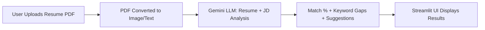

# 🚀 Resume Expert – Powered by Gemini LLM
### Submission for DreamStream “3×3×10” Innovation Challenge  
**Category:** Advanced Tech  
**Created by:** Koushik  

---

## 🔍 Problem Statement  
Applying for jobs without receiving constructive feedback is a frustrating black box for job seekers. Most rejections come without explanation, leaving applicants in the dark about what went wrong—especially regarding how well their resumes align with job descriptions.

---

## 💡 Solution Overview  
**Resume Expert** is a GenAI-powered application that analyzes a user's resume against a specific job description to:  
- Predict **ATS match percentage**  
- Highlight **missing keywords and skills**  
- Deliver **personalized feedback and suggestions** to improve alignment  

Built using **Google's Gemini LLM** and deployed via **Streamlit**, this tool bridges the resume-feedback gap, helping users improve their chances of landing interviews.

---

## 🧱 Architecture / Data Flow  

---

## 🛠️ Tools Used  
1. **Gemini Pro Vision (Google GenAI):** Semantic comparison of resumes and job descriptions  
2. **Streamlit:** Lightweight interface for interaction and visualization  
3. **PDF2Image + PIL:** For PDF parsing and preprocessing before LLM input  

---

## 🧪 Core Features  
- Upload **resume in PDF format**  
- Paste **target job description**  
- Receive:
  - ATS **match percentage**
  - **Missing keywords** and key skill suggestions  
  - **Feedback** on language, structure, and alignment  

---

## 🔧 Challenges Faced  
- Aligning structured PDF content for meaningful LLM analysis  
- Creating reliable feedback prompts within Gemini  
- Ensuring real-time performance on a lightweight frontend  

---

## 🚀 Future Roadmap  
- Handle multi-page resumes  
- Enable **interactive resume editing** within the app  
- Support **upload of job description PDFs**  
- Expand to **cover cover letter review and portfolio scoring**

---

## ✅ Submission Checklist  
- [x] GitHub Codebase  
- [x] Demo Video (3 mins)  
- [x] README with Problem, Solution, Architecture, Tools, and Team Role  

---

🎯 This project empowers job seekers with clarity and direction, transforming resume improvement into a data-driven, personalized experience.
